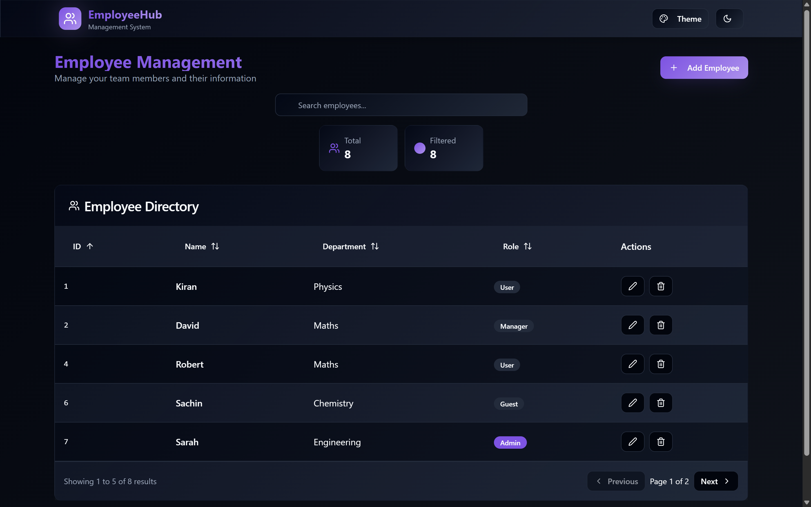

<!-- Banner Image -->
<p align="center">
  
</p>

<h1 align="center">Employee Management - Full Stack Web App</h1>

<p align="center">
  <a href="https://employee-management-steel-phi.vercel.app/" target="_blank"><b>🌐 Live Demo</b></a> &nbsp;|&nbsp;
  <a href="https://github.com/Hmtgit7/employee-management" target="_blank"><b>GitHub Repo</b></a> &nbsp;|&nbsp;
  <a href="https://hemant-gehlod.netlify.app/" target="_blank"><b>Portfolio</b></a>
</p>

---

## 🚀 About the App

**Employee Management** is a modern, full stack web application built with React JS (Vite), Django (Python), and MySQL.  
It provides a seamless interface for managing employee records, featuring advanced table operations like searching, sorting, and pagination.  
This project demonstrates how to connect a React frontend to a Django REST API backend with a MySQL database, enabling robust CRUD operations.

---

## ✨ Features

- ⚡ **Modern UI**: Clean, responsive, and user-friendly interface
- 🔍 **Advanced Table**: Search, sort, and paginate employee data
- 📝 **CRUD Operations**: Create, Read, Update, Delete employees
- 🔗 **RESTful API**: Robust backend with Django & MySQL
- 🔒 **Validation**: Frontend and backend data validation
- 🌐 **Full Stack Integration**: End-to-end connectivity from React to Django to MySQL

---

## 🛠️ Tech Stack

<p>
  
  
  
  
  
  
</p>

---

## 📸 Screenshots

<p align="center">
  
</p>

---

## ⚡ Quick Start

### 1. Clone the Repository

```bash
git clone https://github.com/Hmtgit7/employee-management.git
cd employee-management
```

### 2. Backend Setup (Django + MySQL)

```bash
cd employee_management
python -m venv venv
source venv/bin/activate  # On Windows: venv\Scripts\activate
pip install -r requirements.txt

# Configure your MySQL database in employee_management/settings.py

python manage.py makemigrations
python manage.py migrate
python manage.py runserver
```

### 3. Frontend Setup (React + Vite)

```bash
cd ../employee_frontend
npm install
npm run dev
```

---

## 🧩 Key Concepts Covered

- Setting up React JS and Django for a full stack app
- Building RESTful APIs with Django
- Creating a virtual environment for Python
- Integrating React with Django and MySQL
- Implementing advanced React Table features (search, sort, paginate)
- End-to-end testing from UI to database

---

## 👨‍💻 About the Author

**Hemant Gehlod**  
JAVA Full-Stack Developer | MERN Stack Developer | Freelancer

- Portfolio: [hemant-gehlod.netlify.app](https://hemant-gehlod.netlify.app/)
- GitHub: [Hmtgit7](https://github.com/Hmtgit7)
- LinkedIn: [in/hemant-gehlod](https://www.linkedin.com/in/hemant-gehlod/)

---

## ⭐️ Show Your Support

If you like this project, please ⭐️ the repo and share it with others!

---

<p align="center">
  <b>Made with ❤️ by Hemant Gehlod</b>
</p> 